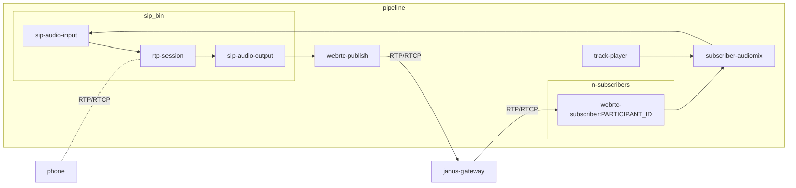

# OpenTalk Obelisk

SIP bridge for the OpenTalk conference system.

## Build the container image

The `Dockerfile` is located in `ci/Dockerfile`.

To build the image, execute in the root of the repository:

```bash
 docker build -f ci/Dockerfile . --tag <your tag>
```

## GStreamer Pipeline (greatly simplified)


