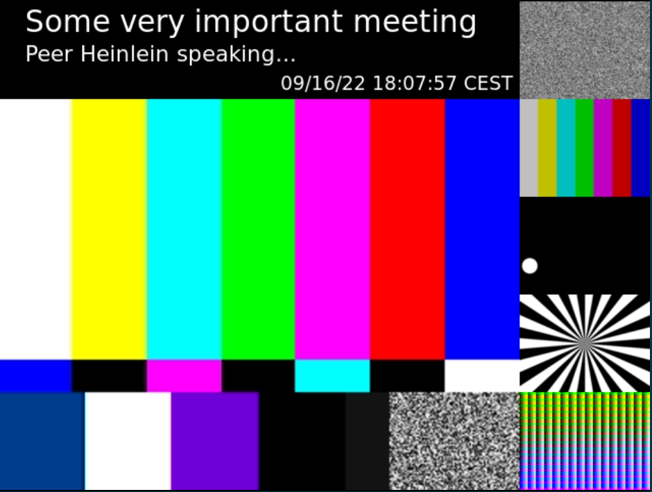
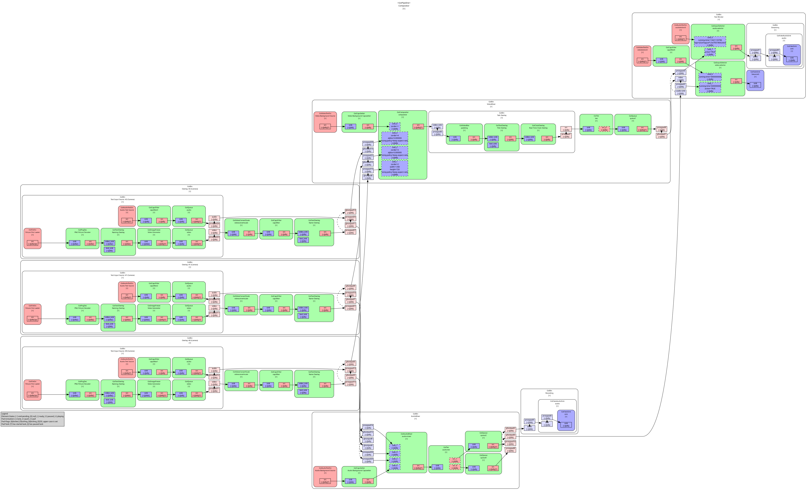

<!--
SPDX-FileCopyrightText: OpenTalk GmbH <mail@opentalk.eu>

SPDX-License-Identifier: EUPL-1.2
-->

# OpenTalk Mixer

[](https://git.heinlein-video.de/p.hoffmann/recorder/-/commits/main)

## Content

- [OpenTalk Mixer](#opentalk-mixer)
    - [Content](#content)
    - [Purpose](#purpose)
    - [Composites](#composites)
        - [Speaker Composite](#speaker-composite)
        - [Grid Composite](#grid-composite)
    - [Start DASH demo](#start-dash-demo)
    - [GStreamer Pipeline](#gstreamer-pipeline)
    - [Known Problems](#known-problems)
    - [Further Documentation](#further-documentation)
    - [Tests](#tests)
    - [Links](#links)
        - [Dash](#dash)
        - [GStreamer](#gstreamer)

## Purpose

This is the recording compositor to be used in *OpenTalk Recorder*.

## Composites

### Speaker Composite

The recording composite `speaker` has slightly different look than the one used in the participants view because this study is a straight forward approach and recording composites might look different in either way because recording (or streaming) presentation usually is different to what each participant is setting up for himself. Additionally we can test if inserting text overlays with title, a clock or other useful information is wishful in recordings.



### Grid Composite

A composite placing all visible participants in a grid.

## Start DASH demo

Please try the following line which starts a demo which uses an existing crate test to generate DASH output of a scene with one participant (simulated by a test video):

```sh
RUST_LOG=trace cargo test test_matroska & sleep 1 ; bin/record-ffmpeg.sh tcp://127.0.0.1:9000 test_output/dash.mpd 1M 5 auto
```

If the cargo build lasts longer then 1s try to precompile or increase the sleep time in the line above.

## GStreamer Pipeline



## Known Problems

- *Dash* seems to need h264 or h265 encoding when writing files
- the *gstreamer* `dashsink` element is quite new and `mp4` muxer is still not working but `ts` does

## Further Documentation

There is a lot of rust inline documentation which you might compile using this line:

```sh
cargo doc
```

## Tests

There are some integration and a few unit tests.
**TODO:** They currently do not succeed if they are started in parallel!

The starting point to that documentation will then be `/recorder/target/doc/compositor/index.html`.

### ENV variables

- `DISPLAY`
- `GST_DEBUG_DUMP_DOT_DIR`
- `USER_TEST`
- `USE_DISPLAY`
- `USE_VIDEO`
- `BE_SLOW`

## Links

Helpful links are listed here:

### Dash

- [FFmpeg DASH parameters](https://ffmpeg.org/ffmpeg-formats.html#dash-2)
- [`ffmpeg` documentation](https://ffmpeg.org/ffmpeg.html)

### GStreamer

- [gstreamer `compositor` documentation](https://git.heinlein-video.de/p.hoffmann/recorder/-/tree/main/compositor)
- [Used Rust GStreamer bindings](https://docs.rs/gstreamer/latest/gstreamer/)
